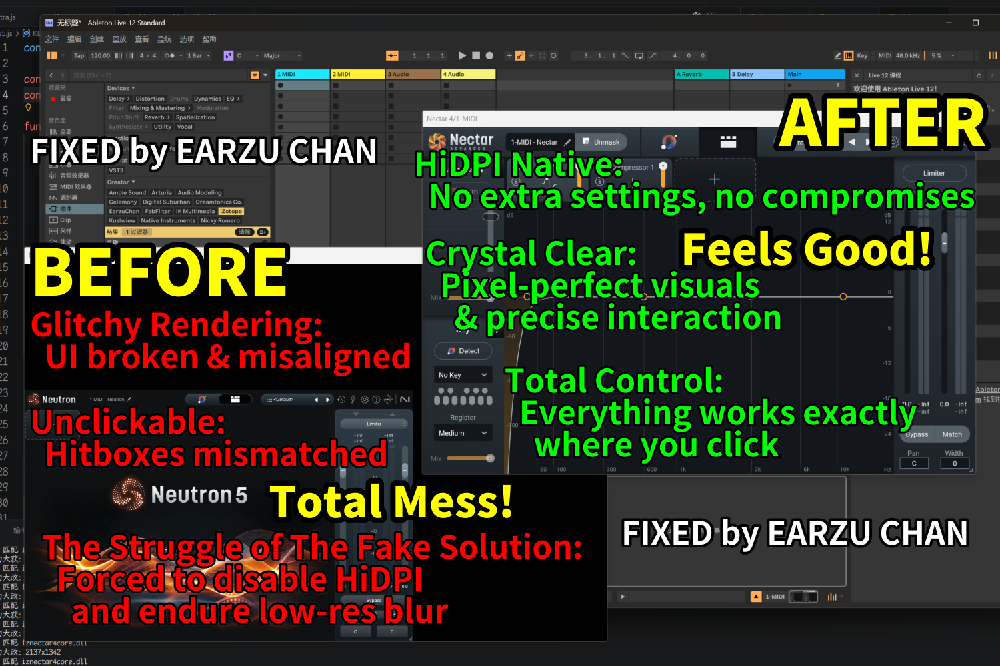

# iZotope HiDPI Scaling Fix for Windows Ableton Live

This document identifies a critical HiDPI rendering bug affecting iZotope plugins within Ableton Live on Windows. We present a comprehensive investigation into its root cause, explore potential workarounds, and provide a dedicated hotfix script to restore UI alignment and visual clarity



## The Bug: Description & Reproduction

When running iZotope plugins (e.g., Nectar 4, Ozone 11, etc.) inside Ableton Live 12 on a Windows system with specific HiDPI configurations, a severe UI rendering mismatch occurs

**Specific Configuration for Reproduction:**
*   **OS Scaling:** Windows 10/11 Display Settings set to >100% (e.g., 150% or 200%). My device is Windows 11, 150%
*   **EXE Compatibility:** Ableton Live 12.exe properties -> Compatibility -> Change high DPI settings -> **"Override high DPI scaling behavior" is checked and set to "Application"**
*   **Ableton Preferences:** "HiDPI Mode" is enabled in the Display/Input tab
*   **Plugin Context Menu:** The option **"Auto-scale Plug-in Window" is manually UNCHECKED** for these VST3 plugins

**Symptoms:**
*   **Visual Displacement:** The plugin UI is rendered at a 1:1 scale, causing it to be squashed into the **bottom-left corner** (occupying only ~66% of the window at 150% scaling). The remaining top and right areas are rendered as a black void
*   **Coordinate Mismatch (Crucial):** The interactive hitboxes remain mapped to the "intended" full-window positions (150% scale)
*   **Functional Impact:** There is a total spatial misalignment between visuals and logic. To interact with a visible button, you must click the "invisible" spot where that button *should* have been if it were properly scaled. Clicking the actual visible elements in the bottom-left corner either triggers nothing or hits the wrong control

## Root Cause & Fix Methodology

This is a classic Graphics API coordinate system misalignment
Analysis reveals that Ableton Live correctly passes the physical window dimensions to the plugin via the VST3 API. The plugin's internal Layout Engine correctly builds the UI tree (hence the correct hitboxes)

However, the legacy OpenGL rendering backend inside the iZotope framework miscalculates the Orthographic Projection Matrix by double-applying the system's DPI scale factor. It expects an oversized coordinate system but attempts to render it into the correct physical viewport, resulting in the GPU squashing the image into the bottom-left corner (OpenGL's origin `(0,0)`)

**The Solution (Dynamic Hooking):**
Instead of attempting to decompile and patch the internal matrix calculations, this PoC utilizes a mathematically inverse approach via **Frida**:
1. Hook `GetClientRect` (user32.dll) to capture the intended physical dimensions the plugin receives from the host
2. Hook `glViewport` (opengl32.dll) right before the GPU draws the frame
3. Multiply the viewport dimensions by the system DPI scale (e.g., 1.5x) to intentionally oversize the physical rendering canvas
4. **Result:** The oversized viewport perfectly neutralizes the engine's internal coordinate scaling error. This creates a pixel-perfect 1:1 mapping. The correct, crisp UI is rendered, aligned with the hitboxes, and the excess rendering area is safely clipped by the Windows HWND manager

## Usage Tutorial

This script injects entirely in memory and does not modify your plugin binaries (`.vst3` or `.dll`) on disk

### Prerequisites
1. Install [Python](https://www.python.org/downloads/)
2. Install Frida-tools via command prompt/terminal:
   ```bash
   pip install frida-tools
   ```

### Running the Fix
1. Launch **Ableton Live 12** (Do not open the iZotope plugin yet)
2. Download the [final.js](final.js) from this repository
3. Open a Command Prompt or PowerShell in the folder where you downloaded the script
4. Run the following command to attach the Frida script to the Ableton process:
   ```bash
   frida -n "Ableton Live 12 Standard.exe" -l final.js
   ```
   *(Note: Adjust the executable name if you are using a different version of Ableton Live)*
5. Once the script says `[*] Started to fix, let's rock!` in the console, load your iZotope plugin inside Ableton
6. The UI should now render perfectly at high resolution, matching your pointer hitboxes

*(Note: The command prompt running Frida must remain open while you are using the plugin. Closing it will detach the hook, and subsequent UI redraws will revert to the buggy state)*

## Notice
This script is provided as a Proof of Concept (PoC) for educational and debugging purposes. It is not officially associated with or endorsed by Native Instruments, iZotope, or Ableton. Use at your own risk
We are formally sharing our bug reports, reproduction steps, technical findings, and PoC scripts with the official Ableton and iZotope teams, and are actively collaborating to resolve the issue. I am more than happy to contribute my humble effort to the well-being of the entire music community